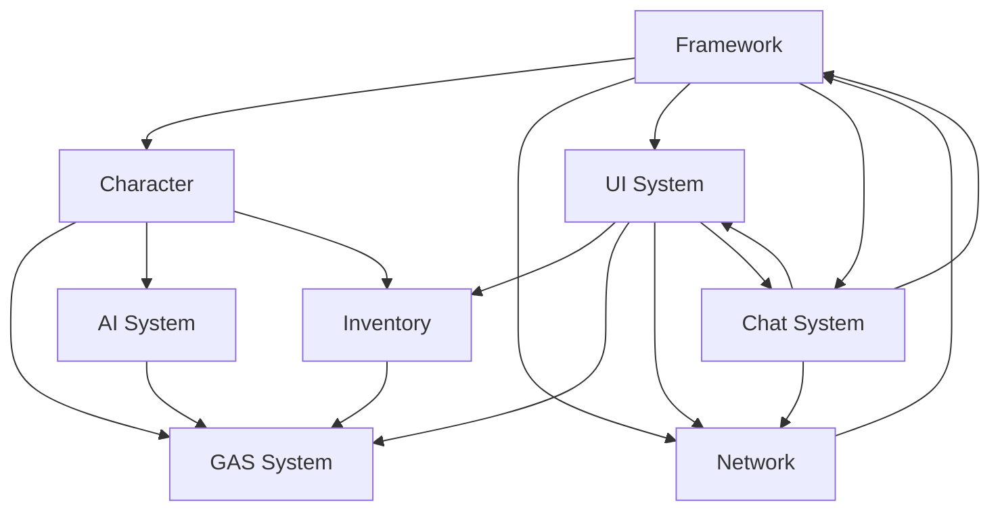

# Crunch 项目架构文档

## 🏗️ 整体架构概览

Crunch是一个基于Unreal Engine 5.4开发的多人对战游戏，采用了模块化的架构设计，确保代码的可维护性和扩展性。

## 📦 核心模块详解

### 1. 游戏框架模块 (Framework)

#### 核心组件
- **游戏模式管理器**: 控制不同游戏阶段的流程
- **玩家状态管理**: 追踪玩家的游戏数据和状态
- **游戏会话**: 管理多人游戏的房间和匹配

#### 关键类
```cpp
// 游戏实例 - 管理整个游戏生命周期
class UMGameInstance : public UGameInstance

// 游戏模式 - 定义游戏规则和流程
class ACrunchGameMode : public AGameModeBase

// 玩家控制器 - 处理玩家输入和网络通信
class ACPlayerController : public APlayerController
```

### 2. 角色系统 (Character)

#### 设计理念
- 数据驱动的角色定义
- 模块化的角色组件
- 支持运行时角色切换

#### 核心组件
```cpp
// 角色定义数据资产
UCLASS(BlueprintType)
class UPDA_CharacterDefinition : public UPrimaryDataAsset

// 角色基类
class ACCharacter : public ACharacter

// 角色组件系统
class UCharacterComponent : public UActorComponent
```

#### 角色属性系统
- **基础属性**: 生命值、护甲、移动速度
- **战斗属性**: 攻击力、技能冷却、护甲穿透
- **成长属性**: 等级、经验值、技能点

### 3. 技能系统 (GAS Integration)

#### GAS核心组件
```cpp
// 属性集 - 定义角色的各种属性
class UCAttributeSet : public UAttributeSet

// 技能系统组件
class UAbilitySystemComponent : public UAbilitySystemComponent

// 游戏效果 - 技能的实际效果实现
class UGameplayEffect : public UGameplayEffect
```

#### 技能升级系统
- **技能点分配**: 每级获得技能点
- **技能树结构**: 支持前置技能要求
- **技能冷却管理**: 全局冷却和独立冷却

#### 技能UI集成
```cpp
// 技能槽UI控件
class UAbilityGauge : public UUserWidget

// 技能升级界面
class UAbilityUpgradeWidget : public UUserWidget
```

### 4. 物品与库存系统 (Inventory)

#### 设计模式
- **组合模式**: 物品合成树结构
- **策略模式**: 不同物品类型的行为
- **观察者模式**: 库存变化通知UI

#### 核心类结构
```cpp
// 商店物品数据资产
class UPDA_ShopItem : public UPrimaryDataAsset

// 库存组件
class UInventoryComponent : public UActorComponent

// 物品树节点接口
class ITreeNodeInterface
```

#### 物品合成系统
- **递归树遍历**: 计算合成路径和成本
- **动态定价**: 根据已有物品调整价格
- **可视化展示**: 实时更新合成树UI

### 5. UI系统架构 (User Interface)

#### 分层设计
```
UI层级结构:
├── Game HUD (游戏内界面)
│   ├── 技能栏 (AbilityGauge)
│   ├── 生命值条 (HealthGauge) 
│   ├── 迷你地图 (MinimapWidget)
│   └── 商店界面 (ShopWidget)
├── Menu System (菜单系统)
│   ├── 主菜单 (MainMenuWidget)
│   ├── 设置界面 (SettingsWidget)
│   └── 加载界面 (LoadingWidget)
└── Lobby System (大厅系统)
    ├── 角色选择 (CharacterSelectionWidget)
    ├── 队伍配置 (TeamSelectionWidget)
    └── 房间管理 (LobbyWidget)
```

#### 渲染系统
```cpp
// 3D渲染到UI基类
class URenderActorWidget : public UUserWidget

// 角色3D预览
class USkeletalMeshRenderWidget : public URenderActorWidget

// 离屏渲染Actor
class ARenderActor : public AActor
```

### 6. 网络架构 (Networking)

#### 网络拓扑
```
网络架构图:
┌─────────────┐    ┌─────────────┐    ┌─────────────┐
│   Client A  │    │   Client B  │    │   Client C  │
└──────┬──────┘    └──────┬──────┘    └──────┬──────┘
       │                  │                  │
       └─────────┬────────┴────────┬─────────┘
                 │                 │
         ┌───────▼─────────┐ ┌─────▼──────┐
         │  Game Server    │ │ Coordinator │
         │  (UE5 Process)  │ │  (Python)   │
         └─────────────────┘ └────────────┘
```

#### 同步策略
- **状态复制**: 玩家位置、生命值等关键数据
- **事件复制**: 技能释放、物品使用等动作
- **可靠传输**: 重要游戏事件确保送达
- **不可靠传输**: 位置更新等高频数据

### 8. 聊天系统 (Chat System)

#### 设计理念
- 实时多人游戏聊天功能
- 支持多频道和发送者类型识别
- 网络同步和丰富的UI交互

#### 核心组件
```cpp
// 聊天数据结构
USTRUCT(BlueprintType)
struct FChatMessage
{
    FString SenderName;
    FString MessageContent; 
    EChatChannelType ChannelType;
    FGenericTeamId SenderTeamId;
    FDateTime Timestamp;
};

// 聊天界面主控件
class UChatWidget : public UUserWidget

// 消息项显示控件
class UChatMessageItemWidget : public UUserWidget

// 聊天接口
class IChatInterface
```

#### 功能特性
- **多频道支持**: 队伍聊天和全体聊天
- **发送者识别**: 自己/队友/对手三种类型
- **富文本显示**: 支持颜色和格式化
- **弹幕模式**: 实时滚动显示
- **临时消息**: 10秒自动隐藏的快速显示
- **永久记录**: 支持聊天历史查看

#### 网络同步策略
- **可靠传输**: 聊天消息使用可靠RPC
- **多播机制**: 服务器统一广播消息
- **团队识别**: 基于GenericTeamId系统
- **频道过滤**: 服务器端进行消息路由

#### UI分层设计
```
聊天UI层级结构:
├── ChatWidget (主聊天界面)
│   ├── ChatScrollBox (消息列表)
│   │   └── ChatMessageItemWidget (单条消息)
│   ├── ChatInputBox (输入框)
│   ├── ChannelComboBox (频道选择)
│   └── SendButton (发送按钮)
└── Barrage System (弹幕系统)
    └── BarrageCanvas (弹幕容器)
        └── ChatMessageItemWidget (弹幕消息项)
```

### 7. AI系统 (Artificial Intelligence)

#### AI架构层次
```cpp
// AI控制器基类
class ACrunchAIController : public AAIController

// 行为树组件
class UBehaviorTreeComponent : public UBehaviorTreeComponent

// 黑板组件
class UBlackboardComponent : public UBlackboardComponent
```

#### AI行为系统
- **状态机**: 巡逻、追击、攻击、撤退
- **感知系统**: 视觉、听觉检测
- **路径规划**: NavMesh导航系统
- **群体行为**: 协同攻击和防御

## 🔧 关键设计模式

### 1. 组件化架构
```cpp
// 示例：角色组件化设计
class ACrunchCharacter : public ACharacter
{
    UPROPERTY(VisibleAnywhere, BlueprintReadOnly)
    TObjectPtr<UInventoryComponent> InventoryComponent;
    
    UPROPERTY(VisibleAnywhere, BlueprintReadOnly)
    TObjectPtr<UAbilitySystemComponent> AbilitySystemComponent;
    
    UPROPERTY(VisibleAnywhere, BlueprintReadOnly)
    TObjectPtr<UCharacterStatsComponent> StatsComponent;
};
```

### 2. 数据驱动设计
```cpp
// 角色定义使用数据资产
UCLASS(BlueprintType)
class UPDA_CharacterDefinition : public UPrimaryDataAsset
{
    UPROPERTY(EditAnywhere, BlueprintReadOnly)
    TObjectPtr<USkeletalMesh> CharacterMesh;
    
    UPROPERTY(EditAnywhere, BlueprintReadOnly)
    TSubclassOf<UAnimInstance> AnimBlueprint;
    
    UPROPERTY(EditAnywhere, BlueprintReadOnly)
    TArray<TSubclassOf<UGameplayAbility>> StartingAbilities;
};
```

### 3. 事件驱动通信
```cpp
// 使用委托实现松耦合通信
DECLARE_MULTICAST_DELEGATE_OneParam(FOnHealthChanged, float /*NewHealth*/);
DECLARE_MULTICAST_DELEGATE_TwoParams(FOnItemPurchased, const UPDA_ShopItem*, int32 /*Quantity*/);
```

## 📊 性能考虑

### 1. 内存管理
- **对象池**: 频繁创建销毁的对象使用对象池
- **智能指针**: 使用TObjectPtr管理UObject引用
- **垃圾回收**: 合理安排UObject的生命周期

### 2. 渲染优化
- **LOD系统**: 根据距离调整模型细节
- **剔除系统**: 视锥体剔除和遮挡剔除
- **批次优化**: 减少Draw Call数量

### 3. 网络优化
- **数据压缩**: 使用UE5内置的网络压缩
- **更新频率**: 根据重要性调整复制频率
- **预测系统**: 客户端预测减少延迟感知

## 🔗 模块依赖关系



## 🚀 扩展性设计

### 1. 插件系统
- 支持第三方插件集成
- 模块化的功能扩展
- 热插拔能力

### 2. 配置系统
- 游戏平衡性参数可配置
- 运行时参数调整
- 数据表驱动的内容

### 3. 多平台支持
- 跨平台网络兼容
- 平台特定的优化
- 移动端适配

## 📈 监控与调试

### 1. 性能监控
- **Stat命令**: 实时性能数据
- **Profiler**: 详细性能分析
- **网络调试**: 网络延迟和丢包监控

### 2. 日志系统
```cpp
// 自定义日志类别
DECLARE_LOG_CATEGORY_EXTERN(LogCrunchGame, Log, All);
DECLARE_LOG_CATEGORY_EXTERN(LogCrunchNetwork, Log, All);
DECLARE_LOG_CATEGORY_EXTERN(LogCrunchUI, Log, All);
```

### 3. 调试工具
- **蓝图调试器**: 可视化蓝图执行
- **世界大纲视图**: 场景对象层次
- **网络复制视图**: 网络数据监控

这个架构文档提供了Crunch项目的完整技术视图，帮助开发者理解系统设计和实现细节。