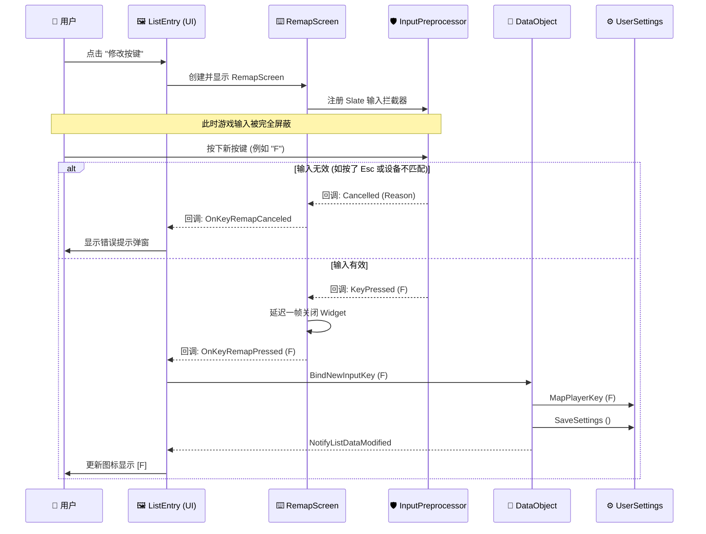
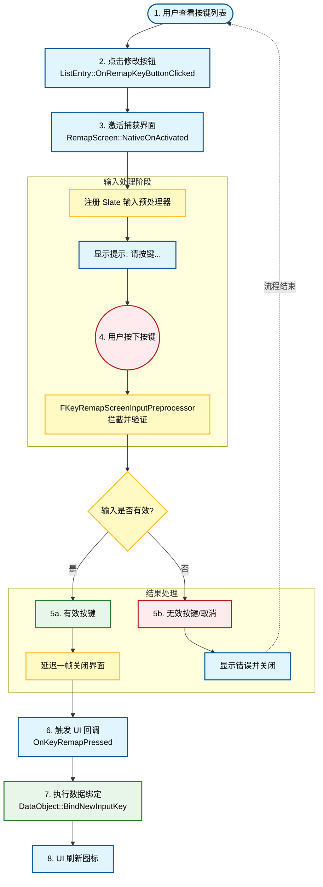
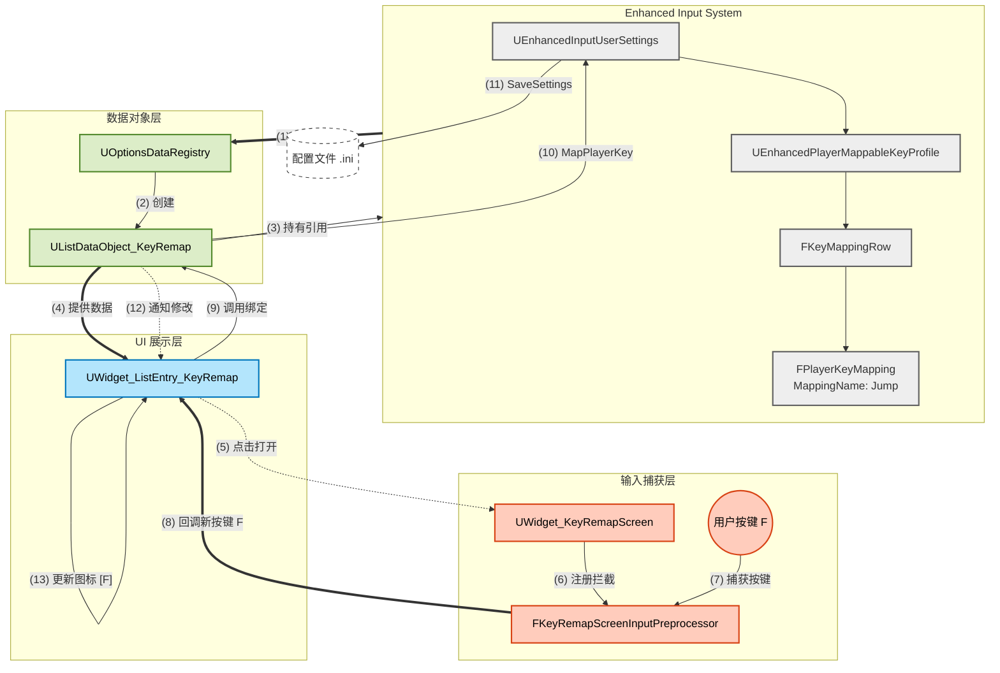

# 控制选项界面完整架构文档

## 概述

本文档详细说明了游戏控制选项界面的完整实现架构，包括数据层、UI 层和输入处理层的三个核心组件：

- **UListDataObject_KeyRemap**: 按键重映射数据对象（数据层）
- **UWidget_ListEntry_KeyRemap**: 按键映射列表项控件（UI 层）
- **UWidget_KeyRemapScreen**: 按键重映射界面（输入处理层）

---

## 整体架构图



---

## 核心组件详解

### 1. UListDataObject_KeyRemap（数据层）

#### 类定义

```cpp
UCLASS()
class CRUNCH_API UListDataObject_KeyRemap : public UListDataObject_Base
```

#### 功能职责

- 缓存按键配置相关的数据
- 管理按键绑定状态
- 提供按键修改接口
- 获取按键图标
- 重置为默认值

#### 关键属性


| 属性名                          | 类型                                 | 说明                   |
| --------------------------------- | -------------------------------------- | ------------------------ |
| `CachedOwningInputUserSettings` | `UEnhancedInputUserSettings*`        | 缓存的输入用户设置对象 |
| `CachedOwningKeyProfile`        | `UEnhancedPlayerMappableKeyProfile*` | 缓存的键位配置文件     |
| `CachedDesiredInputKeyType`     | `ECommonInputType`                   | 缓存的期望输入设备类型 |
| `CachedOwningMappingName`       | `FName`                              | 缓存的映射名称         |
| `CachedOwningMappableKeySlot`   | `EPlayerMappableKeySlot`             | 缓存的可映射键位槽     |

#### 关键方法

##### InitKeyRemapData()

```cpp
void InitKeyRemapData(
    UEnhancedInputUserSettings* InOwningInputUserSettings,
    UEnhancedPlayerMappableKeyProfile* InKeyProfile,
    ECommonInputType InDesiredInputKeyType,
    const FPlayerKeyMapping& InOwningPlayerKeyMapping
);
```

**功能**: 初始化键位重映射数据，缓存必要的引用信息。

**参数**:

- `InOwningInputUserSettings`: 输入用户设置对象
- `InKeyProfile`: 键位配置文件
- `InDesiredInputKeyType`: 期望的输入设备类型（键盘/鼠标 或 手柄）
- `InOwningPlayerKeyMapping`: 玩家键位映射信息

**实现逻辑**:

```cpp
CachedOwningInputUserSettings = InOwningInputUserSettings;
CachedOwningKeyProfile = InKeyProfile;
CachedDesiredInputKeyType = InDesiredInputKeyType;
CachedOwningMappingName = InOwningPlayerKeyMapping.GetMappingName();
CachedOwningMappableKeySlot = InOwningPlayerKeyMapping.GetSlot();
```

---

##### GetIconFromCurrentKey()

```cpp
FSlateBrush GetIconFromCurrentKey() const;
```

**功能**: 根据当前绑定的按键获取对应的图标。

**返回值**: `FSlateBrush` - 按键图标的画刷对象

**实现逻辑**:

```cpp
// 1. 获取通用输入子系统
UCommonInputSubsystem* CommonInputSubsystem = 
    UCommonInputSubsystem::Get(CachedOwningInputUserSettings->GetLocalPlayer());

// 2. 尝试获取输入画刷
const bool bHasFoundBrush = UCommonInputPlatformSettings::Get()->TryGetInputBrush(
    FoundBrush, 
    GetOwningKeyMapping()->GetCurrentKey(),
    CachedDesiredInputKeyType, 
    CommonInputSubsystem->GetCurrentGamepadName()
);

// 3. 返回画刷（找不到则返回空画刷）
return FoundBrush;
```

---

##### BindNewInputKey()

```cpp
void BindNewInputKey(const FKey& InNewKey);
```

**功能**: 绑定新的输入按键到当前映射。

**参数**: `InNewKey` - 新的按键

**实现逻辑**:

```cpp
// 1. 创建映射参数结构
FMapPlayerKeyArgs KeyArgs;
KeyArgs.MappingName = CachedOwningMappingName;
KeyArgs.Slot = CachedOwningMappableKeySlot;
KeyArgs.NewKey = InNewKey;

// 2. 执行按键映射
CachedOwningInputUserSettings->MapPlayerKey(KeyArgs, FGameplayTagContainer());

// 3. 保存设置
CachedOwningInputUserSettings->SaveSettings();

// 4. 通知列表数据已修改
NotifyListDataModified(this);
```

---

##### 重置相关方法

```cpp
bool HasDefaultValue() const;
bool CanResetBackToDefaultValue() const;
bool TryResetBackToDefaultValue();
```

**功能**: 管理按键重置为默认值的功能。

**实现逻辑**:

```cpp
// HasDefaultValue(): 检查是否有默认键
return GetOwningKeyMapping()->GetDefaultKey().IsValid();

// CanResetBackToDefaultValue(): 检查是否可以重置
return HasDefaultValue() && GetOwningKeyMapping()->IsCustomized();

// TryResetBackToDefaultValue(): 执行重置
if (CanResetBackToDefaultValue())
{
    GetOwningKeyMapping()->ResetToDefault();
    CachedOwningInputUserSettings->SaveSettings();
    NotifyListDataModified(this, EOptionsListDataModifyReason::ResetToDefault);
    return true;
}
return false;
```

---

### 2. UWidget_ListEntry_KeyRemap（UI 层）

#### 类定义

```cpp
UCLASS(Abstract, BlueprintType, meta=(DisableNativeTick))
class CRUNCH_API UWidget_ListEntry_KeyRemap : public UWidget_ListEntry_Base
```

#### 功能职责

- 显示按键信息（图标、名称）
- 响应用户点击事件
- 触发改键界面
- 处理重置操作
- 接收回调并更新数据

#### 关键组件


| 组件名                         | 类型                         | 说明                           |
| -------------------------------- | ------------------------------ | -------------------------------- |
| `CommonButton_RemapKey`        | `UFrontendCommonButtonBase*` | 重新映射键按钮（显示按键图标） |
| `CommonButton_ResetKeyBinding` | `UFrontendCommonButtonBase*` | 重置键绑定按钮                 |

#### 生命周期方法

##### OnOwningListDataObjectSet()

```cpp
virtual void OnOwningListDataObjectSet(UListDataObject_Base* InOwningListDataObject) override;
```

**功能**: 当数据对象设置时调用，初始化按键显示。

**实现逻辑**:

```cpp
// 1. 缓存数据对象引用
CachedOwningKeyRemapDataObject = CastChecked<UListDataObject_KeyRemap>(InOwningListDataObject);

// 2. 设置按钮显示的按键图标
CommonButton_RemapKey->SetButtonDisplayImage(
    CachedOwningKeyRemapDataObject->GetIconFromCurrentKey()
);
```

---

##### OnOwningListDataObjectModified()

```cpp
virtual void OnOwningListDataObjectModified(
    UListDataObject_Base* OwningModifiedData, 
    EOptionsListDataModifyReason ModifyReason
) override;
```

**功能**: 当数据对象修改时调用，更新按键显示。

**实现逻辑**:

```cpp
Super::OnOwningListDataObjectModified(OwningModifiedData, ModifyReason);
if (CachedOwningKeyRemapDataObject)
{
    // 更新按键图标
    CommonButton_RemapKey->SetButtonDisplayImage(
        CachedOwningKeyRemapDataObject->GetIconFromCurrentKey()
    );
}
```

---

##### NativeOnInitialized()

```cpp
virtual void NativeOnInitialized() override;
```

**功能**: 初始化组件并绑定按钮点击事件。

**实现逻辑**:

```cpp
Super::NativeOnInitialized();
// 绑定改键按钮点击事件
CommonButton_RemapKey->OnClicked().AddUObject(this, &ThisClass::OnRemapKeyButtonClicked);
// 绑定重置按钮点击事件
CommonButton_ResetKeyBinding->OnClicked().AddUObject(this, &ThisClass::OnResetKeyBindingButtonClicked);
```

---

#### 事件处理方法

##### OnRemapKeyButtonClicked()

```cpp
void OnRemapKeyButtonClicked();
```

**功能**: 处理改键按钮点击事件，打开按键捕获界面。

**实现流程**:


**代码实现**:

```cpp
void UWidget_ListEntry_KeyRemap::OnRemapKeyButtonClicked()
{
    SelectThisEntryWidget(); // 高亮当前行
  
    // 异步打开按键重映射界面
    UFrontendUISubsystem::Get(this)->PushSoftWidgetToStackAsync(
        FrontendGameplayTags::WidgetStack::Modal,
        UFrontendFunctionLibrary::GetFrontendSoftWidgetClassByTag(
            FrontendGameplayTags::Widget::KeyRemapScreen
        ),
        [this](EAsyncPushWidgetState PushState, UWidget_ActivatableBase* PushedWidget)
        {
            if (PushState == EAsyncPushWidgetState::OnCreatedBeforePush)
            {
                UWidget_KeyRemapScreen* KeyRemapScreen = 
                    CastChecked<UWidget_KeyRemapScreen>(PushedWidget);
          
                // 绑定成功回调
                KeyRemapScreen->OnKeyRemapScreenKeyPressed.BindUObject(
                    this, &ThisClass::OnKeyRemapPressed
                );
          
                // 绑定取消回调
                KeyRemapScreen->OnKeyRemapScreenKeySelectCanceled.BindUObject(
                    this, &ThisClass::OnKeyRemapCanceled
                );
          
                // 设置期望的输入设备类型
                if (CachedOwningKeyRemapDataObject)
                {
                    KeyRemapScreen->SetDesiredInputTypeToFilter(
                        CachedOwningKeyRemapDataObject->GetDesiredInputKeyType()
                    );
                }
            }
        }
    );
}
```

---

##### OnResetKeyBindingButtonClicked()

```cpp
void OnResetKeyBindingButtonClicked();
```

**功能**: 处理重置按钮点击事件，恢复按键为默认值。

**实现流程**:

```
1. 高亮当前列表项
   ↓
2. 检查是否可以重置：
   - 如果已经是默认值 → 显示提示对话框
   - 如果可以重置 → 显示确认对话框
   ↓
3. 用户确认后执行重置操作
```

**代码实现**:

```cpp
void UWidget_ListEntry_KeyRemap::OnResetKeyBindingButtonClicked()
{
    if (!CachedOwningKeyRemapDataObject) return;
    SelectThisEntryWidget();
  
    // 检查是否已经是默认值
    if (!CachedOwningKeyRemapDataObject->CanResetBackToDefaultValue())
    {
        UFrontendUISubsystem::Get(this)->PushConfirmScreenToModalStackAsync(
            EConfirmScreenType::Ok,
            FText::FromString(TEXT("重置映射按钮")),
            FText::FromString(CachedOwningKeyRemapDataObject->GetDataDisplayName().ToString() + 
                TEXT("已经是默认值，无需设置")),
            [](EConfirmScreenButtonType ClickedButton){}
        );
        return;
    }
  
    // 显示确认对话框
    UFrontendUISubsystem::Get(this)->PushConfirmScreenToModalStackAsync(
        EConfirmScreenType::YesNo,
        FText::FromString(TEXT("重置映射按钮")),
        FText::FromString(TEXT("您确定要重置") + 
            CachedOwningKeyRemapDataObject->GetDataDisplayName().ToString() + 
            TEXT("按键吗？")),
        [this](EConfirmScreenButtonType ClickedButton)
        {
            if (ClickedButton == EConfirmScreenButtonType::Confirmed)
            {
                CachedOwningKeyRemapDataObject->TryResetBackToDefaultValue();
            }
        }
    );
}
```

---

##### OnKeyRemapPressed()

```cpp
void OnKeyRemapPressed(const FKey& PressedKey);
```

**功能**: 处理按键重映射成功事件。

**代码实现**:

```cpp
void UWidget_ListEntry_KeyRemap::OnKeyRemapPressed(const FKey& PressedKey)
{
    if (CachedOwningKeyRemapDataObject)
    {
        CachedOwningKeyRemapDataObject->BindNewInputKey(PressedKey);
    }
}
```

---

##### OnKeyRemapCanceled()

```cpp
void OnKeyRemapCanceled(const FString& CanceledReason);
```

**功能**: 处理按键重映射取消事件，显示错误提示。

**代码实现**:

```cpp
void UWidget_ListEntry_KeyRemap::OnKeyRemapCanceled(const FString& CanceledReason)
{
    UFrontendUISubsystem::Get(this)->PushConfirmScreenToModalStackAsync(
        EConfirmScreenType::Ok,
        FText::FromString(TEXT("Key Remap")),
        FText::FromString(CanceledReason),
        [](EConfirmScreenButtonType ClickedButton){}
    );
}
```

---

### 3. UWidget_KeyRemapScreen（输入处理层）

#### 类定义

```cpp
UCLASS(Abstract, BlueprintType, meta=(DisableNativeTick))
class CRUNCH_API UWidget_KeyRemapScreen : public UWidget_ActivatableBase
```

#### 功能职责

- 激活时注册 Slate 输入预处理器
- 拦截玩家的输入事件
- 验证输入的有效性
- 返回捕获到的按键或取消原因

#### 关键组件


| 组件名                        | 类型                                           | 说明                                   |
| ------------------------------- | ------------------------------------------------ | ---------------------------------------- |
| `CommonRichText_RemapMessage` | `UCommonRichTextBlock*`                        | 显示提示信息（如"请按下任意键盘按键"） |
| `CachedInputPreprocessor`     | `TSharedPtr<FKeyRemapScreenInputPreprocessor>` | Slate 输入预处理器                     |

#### 委托事件

##### OnKeyRemapScreenKeyPressed

```cpp
DECLARE_DELEGATE_OneParam(FOnKeyRemapScreenKeyPressedDelegate, const FKey&)
FOnKeyRemapScreenKeyPressedDelegate OnKeyRemapScreenKeyPressed;
```

**功能**: 成功捕获到合法按键时触发。

**参数**: `PressedKey` - 捕获到的按键

---

##### OnKeyRemapScreenKeySelectCanceled

```cpp
DECLARE_DELEGATE_OneParam(FOnKeyRemapScreenKeySelectCanceledDelegate, const FString&)
FOnKeyRemapScreenKeySelectCanceledDelegate OnKeyRemapScreenKeySelectCanceled;
```

**功能**: 捕获流程被取消时触发。

**参数**: `CanceledReason` - 取消的原因描述

---

#### 生命周期方法

##### NativeOnActivated()

```cpp
virtual void NativeOnActivated() override;
```

**功能**: Widget 激活时调用，注册输入预处理器。

**实现流程**:

```
1. 创建输入预处理器实例
   ↓
2. 绑定预处理器回调到本 Widget
   ↓
3. 注册到 Slate Application（优先级 -1）
   ↓
4. 更新 UI 提示文本
```

**代码实现**:

```cpp
void UWidget_KeyRemapScreen::NativeOnActivated()
{
    Super::NativeOnActivated();
  
    // 1. 创建输入预处理器
    CachedInputPreprocessor = MakeShared<FKeyRemapScreenInputPreprocessor>(
        CachedDesiredInputType, 
        GetOwningLocalPlayer()
    );
  
    // 2. 绑定回调
    CachedInputPreprocessor->OnInputPreProcessorKeyPressed.BindUObject(
        this, &ThisClass::OnValidKeyPressedDetected
    );
    CachedInputPreprocessor->OnInputPreProcessorKeySelectCanceled.BindUObject(
        this, &ThisClass::OnKeySelectedCanceled
    );
  
    // 3. 注册到 Slate Application
    FSlateApplication::Get().RegisterInputPreProcessor(CachedInputPreprocessor, -1);
  
    // 4. 更新提示文本
    FString InputDeviceName = (CachedDesiredInputType == ECommonInputType::MouseAndKeyboard) 
        ? TEXT("键盘||鼠标") : TEXT("手柄");
    const FString DisplayRichMessage = FString::Printf(
        TEXT("<KeyRemapDefault>请按下任意</> <KeyRemapHighlight>%s</> <KeyRemapDefault>按键</>"), 
        *InputDeviceName
    );
    CommonRichText_RemapMessage->SetText(FText::FromString(DisplayRichMessage));
}
```

---

##### NativeOnDeactivated()

```cpp
virtual void NativeOnDeactivated() override;
```

**功能**: Widget 关闭时调用，注销输入预处理器。

**代码实现**:

```cpp
void UWidget_KeyRemapScreen::NativeOnDeactivated()
{
    Super::NativeOnDeactivated();
  
    // 必须注销处理器，否则会一直拦截输入
    if (CachedInputPreprocessor)
    {
        FSlateApplication::Get().UnregisterInputPreprocessor(CachedInputPreprocessor);
        CachedInputPreprocessor.Reset();
    }
}
```

---

#### 内部回调方法

##### OnValidKeyPressedDetected()

```cpp
void OnValidKeyPressedDetected(const FKey& PressedKey);
```

**功能**: 预处理器检测到有效按键时调用。

**代码实现**:

```cpp
void UWidget_KeyRemapScreen::OnValidKeyPressedDetected(const FKey& PressedKey)
{
    // 延迟关闭并传出按键数据
    RequestDeactivateWidget([this, PressedKey]()
    {
        OnKeyRemapScreenKeyPressed.ExecuteIfBound(PressedKey);
    });
}
```

---

##### OnKeySelectedCanceled()

```cpp
void OnKeySelectedCanceled(const FString& CanceledReason);
```

**功能**: 预处理器决定取消操作时调用。

**代码实现**:

```cpp
void UWidget_KeyRemapScreen::OnKeySelectedCanceled(const FString& CanceledReason)
{
    // 延迟关闭并传出原因
    RequestDeactivateWidget([this, CanceledReason]()
    {
        OnKeyRemapScreenKeySelectCanceled.ExecuteIfBound(CanceledReason);
    });
}
```

---

##### RequestDeactivateWidget()

```cpp
void RequestDeactivateWidget(TFunction<void()> PreDeactivateCallback);
```

**功能**: 延迟一帧关闭 Widget，避免输入丢失。

**原因**:

- 输入事件仍在 Slate / Input 栈中传播
- 立即关闭可能导致输入丢失或焦点状态异常

**代码实现**:

```cpp
void UWidget_KeyRemapScreen::RequestDeactivateWidget(TFunction<void()> PreDeactivateCallback)
{
    // 使用 CoreTicker 延迟到下一帧执行
    FTSTicker::GetCoreTicker().AddTicker(
        FTickerDelegate::CreateLambda([this, PreDeactivateCallback](float DeltaTime)->bool
        {
            PreDeactivateCallback();  // 执行回调
            DeactivateWidget();        // 关闭 Widget
            return false;              // 只运行一次
        })
    );
}
```

---

### 4. FKeyRemapScreenInputPreprocessor（Slate 输入预处理器）

#### 类定义

```cpp
class FKeyRemapScreenInputPreprocessor : public IInputProcessor
```

#### 功能职责

- 拦截底层的键盘和鼠标输入事件
- 验证输入的有效性（类型匹配、按键合法性）
- 消费输入，阻止事件传播到游戏逻辑
- 通过委托返回捕获到的按键或取消原因

#### 关键方法

##### HandleKeyDownEvent()

```cpp
virtual bool HandleKeyDownEvent(FSlateApplication& SlateApp, const FKeyEvent& InKeyEvent) override;
```

**功能**: 处理键盘按键按下事件。

**实现逻辑**:

```cpp
ProcessPressedKey(InKeyEvent.GetKey());
return true;  // 消费输入，阻止传播
```

---

##### HandleMouseButtonDownEvent()

```cpp
virtual bool HandleMouseButtonDownEvent(FSlateApplication& SlateApp, const FPointerEvent& MouseEvent) override;
```

**功能**: 处理鼠标按键按下事件。

**实现逻辑**:

```cpp
ProcessPressedKey(MouseEvent.GetEffectingButton());
return true;  // 消费输入，阻止传播
```

---

##### ProcessPressedKey()

```cpp
void ProcessPressedKey(const FKey& InPressedKey) const;
```

**功能**: 核心逻辑，处理捕获到的按键。

**校验规则**:

1. **Esc 键**: 禁止将 Esc 设置为游戏按键，用于退出菜单
2. **设备匹配检查**:
   - 期望键鼠时，按下手柄键 → 取消
   - 期望手柄时，按下键盘键 → 取消
3. **特殊情况处理**:
   - 手柄模式下，鼠标左键点击可能被识别为手柄的"确认"键
   - 需要将鼠标左键转换为对应的手柄确认键

**代码实现**:

```cpp
void ProcessPressedKey(const FKey& InPressedKey) const
{
    // 规则1: 禁止 Esc 键
    if (InPressedKey == EKeys::Escape)
    {
        OnInputPreProcessorKeySelectCanceled.ExecuteIfBound(TEXT("Esc键保留用于退出，不可映射"));
        return;
    }

    UCommonInputSubsystem* CommonInputSubsystem = 
        UCommonInputSubsystem::Get(CachedWeakOwningLocalPlayer.Get());
    ECommonInputType CurrentInputType = CommonInputSubsystem->GetCurrentInputType();
  
    switch (CachedInputTypeToListenTo)
    {
    case ECommonInputType::MouseAndKeyboard:
        // 键鼠模式：拒绝手柄输入
        if (InPressedKey.IsGamepadKey() || CurrentInputType == ECommonInputType::Gamepad)
        {
            OnInputPreProcessorKeySelectCanceled.ExecuteIfBound(
                TEXT("检测到手柄输入，请按下键盘或鼠标按键")
            );
            return;
        }
        break;
  
    case ECommonInputType::Gamepad:
        // 手柄模式：鼠标左键点击特殊处理
        if (CurrentInputType == ECommonInputType::Gamepad && InPressedKey == EKeys::LeftMouseButton)
        {
            // 转换为手柄确认键
            if(const FCommonInputActionDataBase* InputActionData = 
                ICommonInputModule::GetSettings().GetDefaultClickAction()
                    .GetRow<FCommonInputActionDataBase>(TEXT("CommonUI配置缺失")))
            {
                OnInputPreProcessorKeyPressed.ExecuteIfBound(
                    InputActionData->GetDefaultGamepadInputTypeInfo().GetKey()
                );
            }
            return;
        }
  
        // 拒绝非手柄输入
        if (!InPressedKey.IsGamepadKey())
        {
            OnInputPreProcessorKeySelectCanceled.ExecuteIfBound(
                TEXT("检测到键盘输入，请按下手柄按键")
            );
            return;
        }
        break;
    }

    // 验证通过，广播按键
    OnInputPreProcessorKeyPressed.ExecuteIfBound(InPressedKey);
}
```

---

## 完整工作流程

### 1. 🔄 用户修改按键流程图 (Workflow)

这个图表使用流程图 (`graph TD`) 表达，重点强化了**状态流转**和**分支逻辑**（有效/无效按键）。



---

### 2. 💾 数据流转架构图 (Data Flow)

这个图表展示了数据如何在**引擎层**、**数据层**、**UI 层**和**输入层**之间流动。我使用了嵌套的 `subgraph` 来还原你 ASCII 图中 `Enhanced Input System` 的层级结构。



### 💡 如何使用这些代码

1. **Markdown 编辑器**：如果你使用的是 Obsidian、Typora、VS Code (配合 Markdown Preview Enhanced 插件) 或 Notion，直接复制上面的代码块即可渲染。
2. **GitHub/GitLab**：直接在 README.md 或 Wiki 中粘贴代码块，并将语言标识设置为 `mermaid`。
3. **在线编辑器**：你可以将代码粘贴到 [Mermaid Live Editor](https://mermaid.live/) 中生成高清图片下载。

### ✨ 优化点说明

* **色彩编码**：
  * ⚪ **灰色/引擎色**：代表 Unreal Engine 底层系统。
  * 🟢 **绿色/数据色**：代表你的 C++ 数据对象层 (Model)。
  * 🔵 **蓝色/UI色**：代表 UMG 控件层 (View)。
  * 🔴 **红色/输入色**：代表用户交互和输入拦截 (Controller)。
* **形状区分**：
  * 使用 `[矩形]` 表示类/对象。
  * 使用 `((圆形))` 表示用户动作。
  * 使用 `[(圆柱)]` 表示文件存储。
  * 使用 `{菱形}` 表示逻辑判断。
* **连线风格**：
  * 实线：表示直接调用或强引用。
  * 虚线：表示回调、通知或弱引用。
  * 粗线：表示主要的数据流向。

---

## 关键技术点

### 1. Slate 输入预处理器的使用

**为什么需要 Slate 输入预处理器？**

- UMG 的输入处理在 Enhanced Input 之后，无法拦截到原始输入
- 需要在最底层拦截输入，避免改键时触发游戏逻辑
- `IInputProcessor` 是 Slate 提供的低级输入钩子

**如何注册和注销？**

```cpp
// 注册（优先级 -1 表示尽早处理）
FSlateApplication::Get().RegisterInputPreProcessor(Preprocessor, -1);

// 注销（必须在 Widget 关闭时执行）
FSlateApplication::Get().UnregisterInputPreprocessor(Preprocessor);
```

---

### 2. 输入设备类型过滤

**为什么要过滤输入设备类型？**

- 避免用户在手柄模式下误按键盘
- 避免用户在键盘模式下误按手柄
- 提供清晰的错误提示

**如何实现？**

```cpp
// 检查按键类型
bool bIsGamepadKey = InPressedKey.IsGamepadKey();

// 检查当前系统输入类型
ECommonInputType CurrentInputType = CommonInputSubsystem->GetCurrentInputType();

// 根据期望类型进行验证
if (DesiredType == ECommonInputType::MouseAndKeyboard)
{
    if (bIsGamepadKey || CurrentInputType == ECommonInputType::Gamepad)
    {
        // 拒绝输入
    }
}
```

---

### 3. 延迟关闭 Widget

**为什么要延迟关闭？**

- 输入事件仍在 Slate / Input 栈中传播
- 立即关闭会导致：
  - 输入丢失
  - 焦点状态异常
  - 可能导致 Crash

**如何实现？**

```cpp
FTSTicker::GetCoreTicker().AddTicker(
    FTickerDelegate::CreateLambda([this, Callback](float DeltaTime)->bool
    {
        Callback();         // 先执行回调
        DeactivateWidget(); // 再关闭 Widget
        return false;       // 只运行一次
    })
);
```

---

### 4. 数据对象与 UI 的分离

**设计模式：MVC 模式**

- **Model (数据层)**: `UListDataObject_KeyRemap`

  - 管理按键配置数据
  - 提供数据修改接口
- **View (视图层)**: `UWidget_ListEntry_KeyRemap`

  - 显示按键信息
  - 响应用户交互
- **Controller (控制层)**: `UWidget_KeyRemapScreen`

  - 处理输入捕获
  - 验证输入有效性

**优点：**

- 数据和 UI 分离，易于维护
- 可以复用数据对象
- 支持多种 UI 展示方式

---

## 扩展功能建议

### 1. 按键冲突检测

```cpp
bool CheckKeyConflict(const FKey& InKey, FName IgnoreMappingName)
{
    // 遍历所有按键映射，检查是否有重复
    for (auto& MappingRow : Profile->GetPlayerMappingRows())
    {
        for (auto& KeyMapping : MappingRow.Value.Mappings)
        {
            if (KeyMapping.GetMappingName() != IgnoreMappingName &&
                KeyMapping.GetCurrentKey() == InKey)
            {
                return true; // 冲突
            }
        }
    }
    return false;
}
```

---

### 2. 按键方案预设

```cpp
// 保存当前方案为预设
void SaveKeyProfileAsPreset(FName PresetName);

// 加载预设方案
void LoadKeyProfilePreset(FName PresetName);

// 删除预设方案
void DeleteKeyProfilePreset(FName PresetName);
```

---

### 3. 按键搜索和过滤

```cpp
// 在列表项中添加搜索功能
void SetSearchFilter(const FString& FilterText);

// 显示所有移动相关按键
void ShowCategoryOnly(FName CategoryName);
```

---

### 4. 按键动画效果

```cpp
// 按键按下时的动画
void PlayKeyPressAnimation();

// 按键重置成功时的动画
void PlayResetSuccessAnimation();
```

---

## 相关文件清单

### 头文件

- `Source/Crunch/Private/FrontendUI/Widgets/Options/OptionsDataRegistry.h`
- `Source/Crunch/Private/FrontendUI/Widgets/Options/DataObjects/ListDataObject_KeyRemap.h`
- `Source/Crunch/Private/FrontendUI/Widgets/Options/ListEntries/Widget_ListEntry_KeyRemap.h`
- `Source/Crunch/Private/FrontendUI/Widgets/Options/Widget_KeyRemapScreen.h`

### 源文件

- `Source/Crunch/Private/FrontendUI/Widgets/Options/OptionsDataRegistry.cpp`
- `Source/Crunch/Private/FrontendUI/Widgets/Options/DataObjects/ListDataObject_KeyRemap.cpp`
- `Source/Crunch/Private/FrontendUI/Widgets/Options/ListEntries/Widget_ListEntry_KeyRemap.cpp`
- `Source/Crunch/Private/FrontendUI/Widgets/Options/Widget_KeyRemapScreen.cpp`

### 依赖文件

- `Source/Crunch/Private/FrontendUI/FrontendFunctionLibrary.h/cpp`
- `Source/Crunch/Private/FrontendUI/Subsystems/FrontendUISubsystem.h`
- `Source/Crunch/Private/FrontendUI/Widgets/Widget_ActivatableBase.h`
- `Source/Crunch/Private/FrontendUI/Widgets/Components/FrontendCommonButtonBase.h`

---

## 总结

本架构通过三层分离的方式实现了一个完整的按键重映射系统：

1. **数据层** (`UListDataObject_KeyRemap`) - 管理按键配置数据
2. **UI 层** (`UWidget_ListEntry_KeyRemap`) - 展示按键信息并响应用户操作
3. **输入处理层** (`UWidget_KeyRemapScreen`) - 捕获并验证用户输入

**核心技术点：**

- 使用 Slate 输入预处理器拦截底层输入
- 延迟关闭 Widget 避免输入丢失
- MVC 模式分离数据和 UI
- 委托机制实现组件间通信

**优势：**

- 模块化设计，易于维护和扩展
- 支持键盘鼠标和手柄双输入设备
- 输入验证机制防止误操作
- 数据和 UI 分离，支持多种展示方式

这个架构充分利用了 Unreal Engine 5 的 Enhanced Input 系统和 CommonUI 框架，提供了一个灵活、可靠、易于扩展的按键重映射解决方案。
